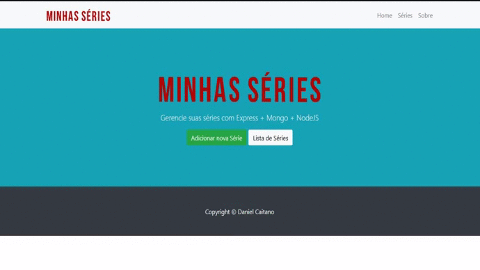

<h1 align="center">
 
  
 
 
</h1>

This project is to help you manage your series
        

  

[//]: # (Add your gifs/images here:)

  

## Features
[//]: # (Add the features of your project here:)
This app features all the latest tools and practices in mobile development!

- 💹 **Node Js** — A web framework for Node Js
- 📄 **MongoDB** — A database no SQL
- ♻️ **Mongoose** — A MongoDB object modeling tool

## Getting started

1. You need have <code>npm</code> or <code>yarn</code> and a <b>database</b> installed 
2. Clone or Download this repo using the button <b>CODE</b> at the top this page  
3. In the project's directory run <code>npm install</code> or <code>yarn</code> to install dependencies  
4. Connect your database in the project
5. Run <code>npm start</code> or <code>yarn start</code> to start the application   

## License

This project is licensed under the MIT License - see the [LICENSE](https://opensource.org/licenses/MIT) page for details.
